<div align="center">

# 🛡️ LAB 14 — Bypass Root Detection sur Android  
## Techniques Dynamiques avec Frida, Objection et Hooks Natifs

<br>


<br>

**Cours : Sécurité des Applications Mobiles**  
**Objectif : Contourner dynamiquement une détection de root Android dans un environnement contrôlé**

</div>

---

## 📌 Table des matières

- [Présentation du lab](#-présentation-du-lab)
- [Avertissement légal](#-avertissement-légal)
- [Environnement utilisé](#-environnement-utilisé)
- [Objectifs pédagogiques](#-objectifs-pédagogiques)
- [Architecture du projet](#-architecture-du-projet)
- [Méthodologie suivie](#-méthodologie-suivie)
- [Étape 1 — Vérification des outils](#-étape-1--vérification-des-outils)
- [Étape 2 — Installation de l'application cible](#-étape-2--installation-de-lapplication-cible)
- [Étape 3 — Préparation de Frida Server](#-étape-3--préparation-de-frida-server)
- [Étape 4 — Test d'injection Frida](#-étape-4--test-dinjection-frida)
- [Étape 5 — Bypass Java avec Frida](#-étape-5--bypass-java-avec-frida)
- [Étape 6 — Bypass Java + hooks natifs](#-étape-6--bypass-java--hooks-natifs)
- [Étape 7 — Test avec Objection](#-étape-7--test-avec-objection)
- [Résultats obtenus](#-résultats-obtenus)
- [Difficultés rencontrées](#-difficultés-rencontrées)
- [Analyse comparative](#-analyse-comparative)
- [Conclusion](#-conclusion)

---

# 🧩 Présentation du lab

Ce lab porte sur le **bypass dynamique de la détection de root** dans une application Android volontairement vulnérable : **AndroGoat**.

L’objectif n’est pas de modifier directement l’APK, mais d’utiliser des techniques d’instrumentation dynamique afin d’intercepter certains appels sensibles au moment de l’exécution.

Dans ce travail, plusieurs approches ont été testées :

- Injection simple avec **Frida**
- Bypass des checks Java classiques
- Bypass de certains checks natifs via `libc`
- Utilisation d’**Objection** comme surcouche automatisée à Frida
- Comparaison de l’état de l’application avant et après bypass

---

# ⚖️ Avertissement légal

> Ce lab a été réalisé uniquement dans un cadre académique, sur une application pédagogique et dans un environnement de test autorisé.

Les techniques présentées ici doivent être utilisées uniquement :

- sur des applications que l’on possède ;
- dans un environnement de laboratoire ;
- dans le cadre d’un audit autorisé ;
- pour l’apprentissage de la sécurité mobile.

Elles ne doivent pas être utilisées contre des applications, systèmes ou appareils sans autorisation explicite.

---

# 🖥️ Environnement utilisé

| Élément | Valeur |
|---|---|
| Système hôte | Windows 10 |
| Terminal | PowerShell |
| Appareil cible | Émulateur Android |
| Identifiant ADB | `emulator-5554` |
| Application cible | `AndroGoat.apk` |
| Package utilisé | `owasp.sat.agoat` |
| Outils principaux | ADB, Frida, Frida Server, Objection |
| Type de test | Instrumentation dynamique |

---

# 🎯 Objectifs pédagogiques

À travers ce lab, les objectifs principaux sont :

- comprendre comment une application Android peut détecter un environnement rooté ;
- identifier les checks Java courants ;
- intercepter dynamiquement des appels sensibles avec Frida ;
- utiliser des hooks natifs pour bloquer certains appels système ;
- tester Objection pour automatiser une partie du contournement ;
- documenter une démarche complète avec preuves, logs et captures.

---

# 📁 Architecture du projet

```text
LAB14_RootBypass_Frida_Objection
│   .gitignore
│   frida-server
│   frida-server-17.10.1-android-x86_64.xz
│
├───apk
│       AndroGoat.apk
│
├───notes
│       commands.txt
│       observations.txt
│
├───report
│
├───screenshots
│       adb_devices_version.png
│       androgoat_home.png
│       androgoat_install.png
│       bypass_root_java_logs.png
│       bypass_root_java_native_logs.png
│       frida-server_push_ps-Uai.png
│       hello_js_injection.png
│       objection_android_root_disable.png
│       objection_android_root_disable_retry.png
│       objection_root_disable_crash.png
│       objection_successful_disable_root.png
│       objection_version.png
│       python_frida_versions.png
│       root_detection_after_frida_bypass.png
│       root_detection_after_java_bypass.png
│       root_detection_before_bypass.png
│
└───scripts
        bypass_root_java.js
        bypass_root_native.js
        hello.js
```

---

# 🧠 Méthodologie suivie

La démarche du lab a été divisée en plusieurs phases :

```text
1. Préparer l’environnement
2. Installer et lancer l’application cible
3. Observer la détection root avant bypass
4. Déployer frida-server sur l’émulateur
5. Tester une injection simple avec hello.js
6. Hooker les checks Java avec Frida
7. Ajouter des hooks natifs pour renforcer le bypass
8. Tester Objection comme solution automatisée
9. Comparer les résultats avant / après
10. Documenter les preuves et les difficultés
```

---

# 🔹 Étape 1 — Vérification des outils

Avant de commencer l’instrumentation, les outils nécessaires ont été vérifiés depuis PowerShell.

## Commandes utilisées

```powershell
adb version
adb devices

python --version
pip --version

frida --version
python -c "import frida; print(frida.__version__)"

python -m pip show objection
objection --help
```

## Résultat attendu

ADB doit détecter l’émulateur avec l’état `device`.

```text
List of devices attached
emulator-5554   device
```

## Preuve

<p align="center">
  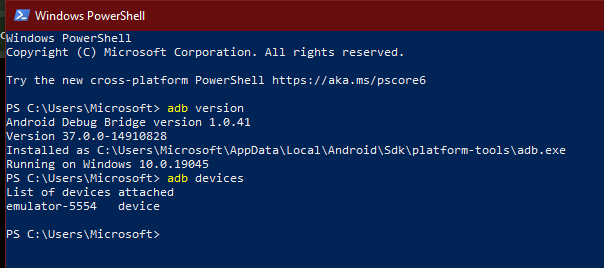
</p>

<p align="center">
  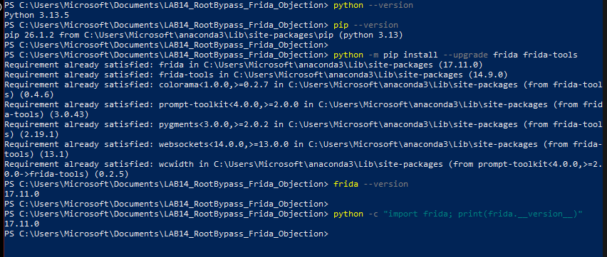
</p>

<p align="center">
  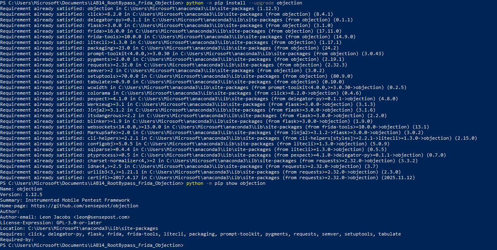
</p>

## Remarque

La commande suivante n’était pas supportée dans cette version d’Objection :

```powershell
objection --version
```

La vérification a donc été faite avec :

```powershell
python -m pip show objection
objection --help
```

---

# 🔹 Étape 2 — Installation de l’application cible

L’application utilisée pour le lab est **AndroGoat**, une application volontairement vulnérable destinée à l’apprentissage de la sécurité Android.

## Commande d’installation

```powershell
adb install -r .\apk\AndroGoat.apk
```

## Lancement de l’application

```powershell
adb shell monkey -p owasp.sat.agoat 1
```

## Preuves

<p align="center">
  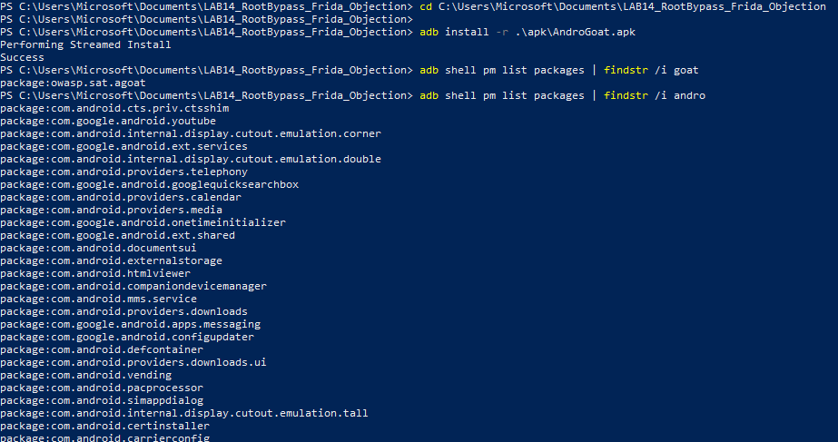
</p>

<p align="center">
  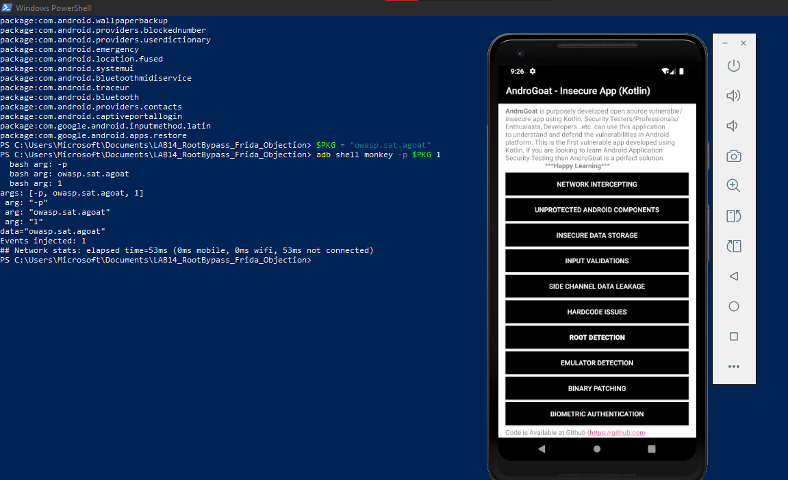
</p>

---

# 🔹 Étape 3 — Observation avant bypass

Avant d’appliquer les hooks, l’application a été lancée normalement afin d’observer son comportement initial.

L’environnement étant rooté, l’application détecte la présence du root.

## Preuve avant contournement

<p align="center">
  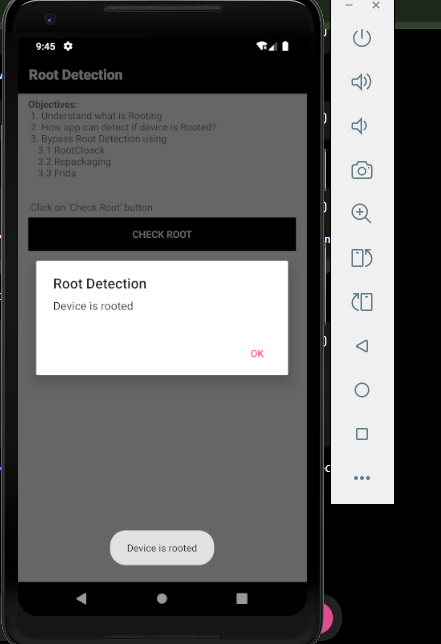
</p>

## Analyse

À ce stade, l’application peut détecter le root à travers plusieurs méthodes possibles :

- vérification de fichiers suspects comme `su` ;
- lecture de propriétés système ;
- exécution de commandes comme `which su` ;
- détection de BusyBox ;
- utilisation de bibliothèques spécialisées comme RootBeer ;
- appels natifs vers des fonctions comme `open`, `access`, `stat`.

---

# 🔹 Étape 4 — Préparation de Frida Server

Pour pouvoir injecter des scripts Frida dans l’application Android, il faut lancer `frida-server` sur l’émulateur.

## Vérification de l’architecture CPU

```powershell
adb shell getprop ro.product.cpu.abi
```

Dans ce lab, l’émulateur utilise une architecture de type :

```text
x86_64
```

Le binaire utilisé est donc :

```text
frida-server-android-x86_64
```

## Déploiement de frida-server

```powershell
adb push frida-server /data/local/tmp/frida-server
adb shell chmod 755 /data/local/tmp/frida-server
adb root
adb shell "/data/local/tmp/frida-server -l 0.0.0.0 >/dev/null 2>&1 &"
```

## Redirection des ports Frida

```powershell
adb forward tcp:27042 tcp:27042
adb forward tcp:27043 tcp:27043
```

## Vérification de la connexion

```powershell
frida-ps -Uai
```

## Preuve

<p align="center">
  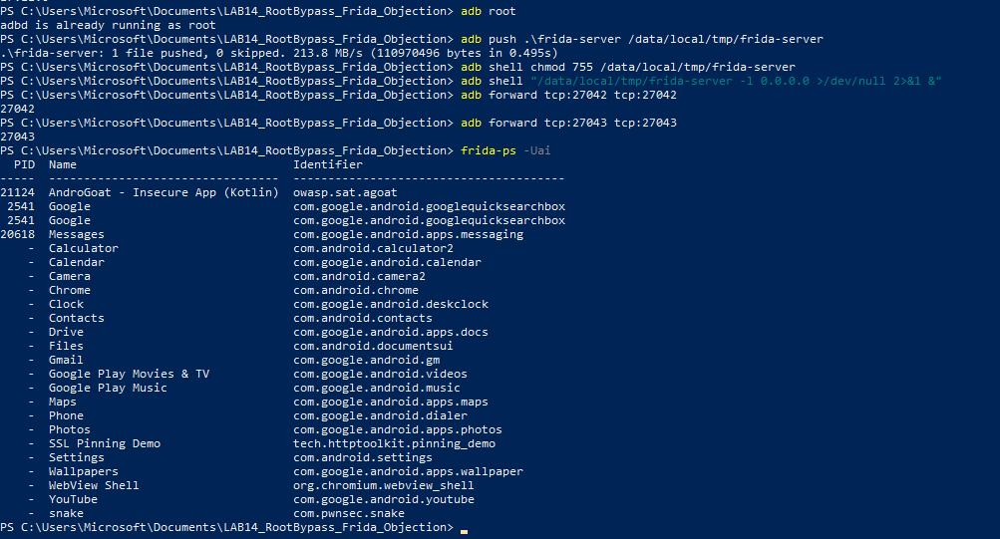
</p>

---

# 🔹 Étape 5 — Test d’injection Frida

Avant d’installer des hooks complexes, un test simple a été réalisé avec un script `hello.js`.

## Script utilisé : `scripts/hello.js`

```javascript
Java.perform(function () {
    console.log("[LAB14] Injection Frida réussie : Java.perform OK");
});
```

## Commande d’exécution

```powershell
frida -U -f owasp.sat.agoat -l .\scripts\hello.js
```

## Résultat

Le script s’injecte correctement dans le processus de l’application, ce qui confirme que :

- Frida côté PC fonctionne ;
- frida-server communique bien avec l’émulateur ;
- l’application cible peut être instrumentée dynamiquement.

## Preuve

<p align="center">
  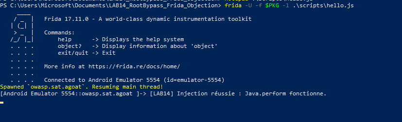
</p>

---

# 🔹 Étape 6 — Bypass Java avec Frida

La première vraie phase de contournement consiste à intercepter les vérifications Java classiques.

## Checks ciblés

Le script `bypass_root_java.js` cible notamment :

| Élément hooké | Objectif |
|---|---|
| `android.os.Build.TAGS` | Remplacer `test-keys` par une valeur non suspecte |
| `java.io.File.exists()` | Masquer les fichiers comme `su` ou `busybox` |
| `Runtime.exec()` | Bloquer les commandes suspectes |
| `RootBeer.isRooted()` | Forcer le retour à `false` si RootBeer est présent |

## Commande utilisée

```powershell
frida -U -f owasp.sat.agoat -l .\scripts\bypass_root_java.js
```

## Logs obtenus

Les logs montrent que plusieurs hooks ont été installés et que certains appels suspects ont été interceptés.

<p align="center">
  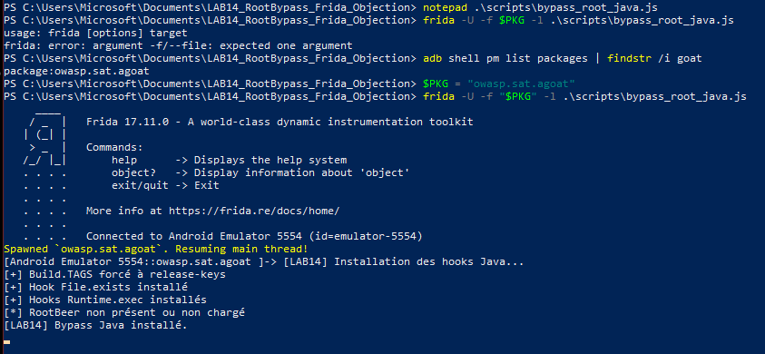
</p>

## Résultat après bypass Java

<p align="center">
  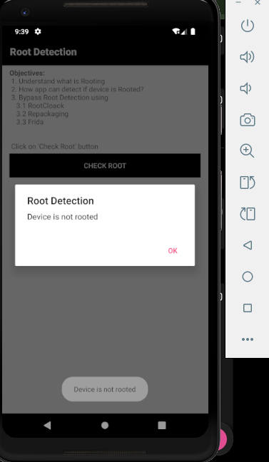
</p>

## Analyse

Le bypass Java permet de neutraliser plusieurs vérifications classiques, mais il ne couvre pas forcément tous les scénarios.  
Certaines applications utilisent également du code natif pour accéder directement au système de fichiers ou aux propriétés du système.

---

# 🔹 Étape 7 — Bypass Java + hooks natifs

Pour renforcer le contournement, un second script a été utilisé : `bypass_root_native.js`.

Ce script intercepte certains appels natifs liés à `libc`.

## Fonctions natives ciblées

| Fonction native | Rôle possible dans la détection |
|---|---|
| `open` | Ouverture de fichiers suspects |
| `openat` | Ouverture relative à un descripteur |
| `access` | Vérification d’existence ou de permissions |
| `stat` | Lecture des métadonnées d’un fichier |
| `lstat` | Variante de `stat` pour liens symboliques |
| `fopen` | Ouverture de fichiers via libc |

## Commande combinée

```powershell
frida -U -f owasp.sat.agoat -l .\scripts\bypass_root_java.js -l .\scripts\bypass_root_native.js
```

## Preuve des logs Java + natif

<p align="center">
  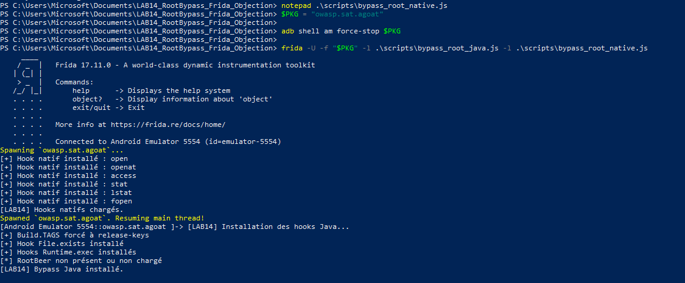
</p>

## Résultat après bypass complet Frida

<p align="center">
  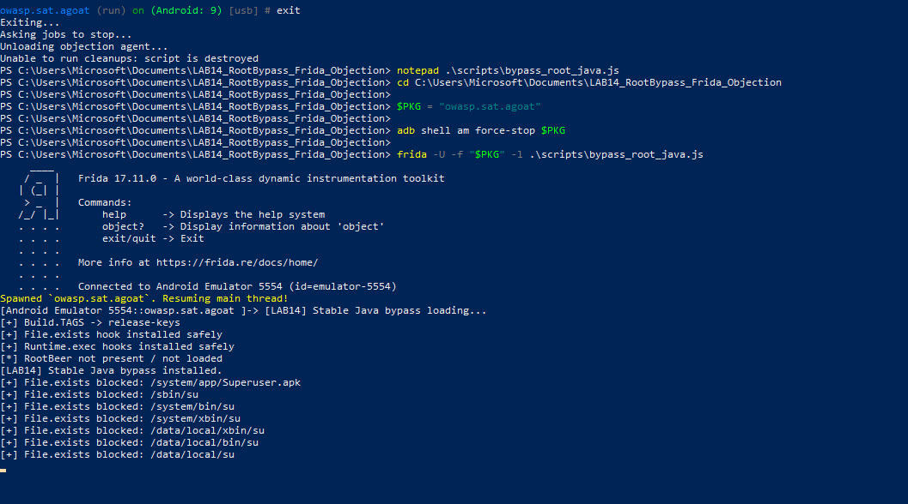
</p>

## Analyse

L’ajout de hooks natifs améliore la couverture du bypass.  
Cette approche est plus complète que le bypass Java seul, car elle permet de bloquer des accès bas niveau vers des chemins ou fichiers sensibles.

---

# 🔹 Étape 8 — Test avec Objection

Objection a ensuite été testé comme solution automatisée.

Objection est une surcouche à Frida qui propose des commandes prêtes à l’emploi pour plusieurs tâches de sécurité mobile.

## Commande utilisée

```powershell
objection -g owasp.sat.agoat explore
```

Puis dans la console Objection :

```text
android root disable
```

Une autre tentative peut aussi être lancée directement avec :

```powershell
objection -g owasp.sat.agoat explore --startup-command "android root disable"
```

## Premier essai

<p align="center">
  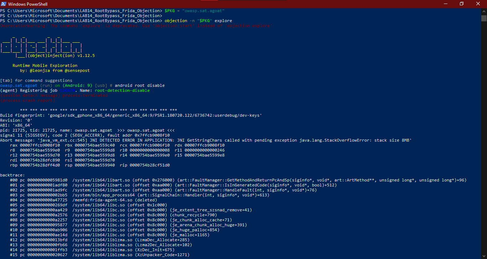
</p>

## Tentative avec crash

Pendant les tests, une tentative avec Objection a provoqué un crash ou une exception côté instrumentation.

<p align="center">
  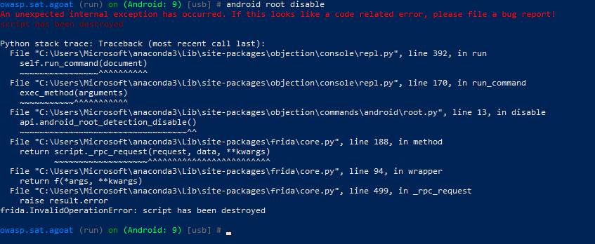
</p>

## Nouvelle tentative

<p align="center">
  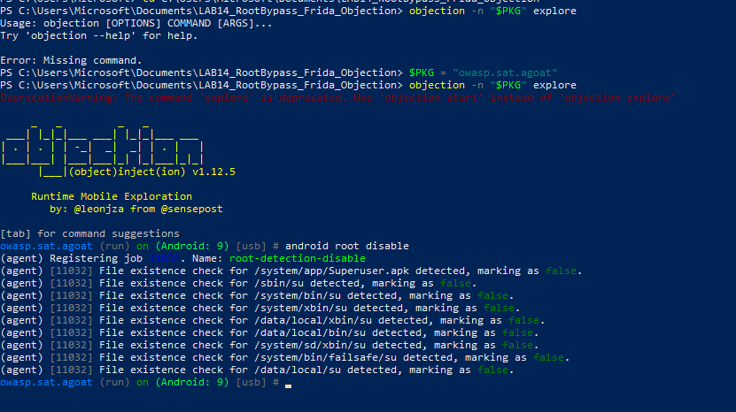
</p>

## Résultat réussi

<p align="center">
  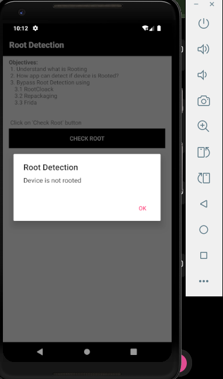
</p>

## Analyse

Objection est très pratique pour automatiser les hooks courants, mais il peut être moins stable ou moins précis qu’un script Frida personnalisé.

Dans ce lab, Objection a été utile pour tester rapidement un bypass root, mais les scripts Frida manuels restent plus flexibles pour comprendre et contrôler précisément les hooks appliqués.

---

# 📊 Résultats obtenus

| Test | Résultat |
|---|---|
| ADB détecte l’émulateur | Réussi |
| Installation de l’APK | Réussie |
| Lancement de Frida Server | Réussi |
| `frida-ps -Uai` liste les applications | Réussi |
| Injection simple avec `hello.js` | Réussie |
| Détection root avant bypass | Confirmée |
| Bypass Java avec Frida | Réussi |
| Bypass Java + natif | Réussi |
| Test avec Objection | Réussi après retry |
| Documentation avec preuves | Réalisée |

---

# 🧪 Comparaison avant / après

<div align="center">

<table>
<tr>
<td align="center"><b>Avant bypass</b></td>
<td align="center"><b>Après bypass Frida</b></td>
</tr>
<tr>
<td></td>
<td></td>
</tr>
</table>

</div>

## Interprétation

Avant l’injection Frida, l’application détectait l’environnement rooté.  
Après l’installation des hooks Java et natifs, les vérifications ont été interceptées afin de retourner des valeurs non suspectes.

Le contournement est donc réalisé dynamiquement, sans modification directe de l’APK.

---

# 🧰 Scripts utilisés

## `hello.js`

Ce script sert uniquement à vérifier que Frida peut injecter du JavaScript dans le processus de l’application.

```javascript
Java.perform(function () {
    console.log("[LAB14] Injection Frida réussie : Java.perform OK");
});
```

---

## `bypass_root_java.js`

Ce script neutralise les vérifications Java les plus fréquentes :

- `Build.TAGS`
- `File.exists()`
- `Runtime.exec()`
- `RootBeer.isRooted()`

Il permet de modifier le comportement de l’application au moment de l’exécution.

---

## `bypass_root_native.js`

Ce script ajoute une couche de protection contre certains checks natifs.

Il intercepte notamment :

- `open`
- `openat`
- `access`
- `stat`
- `lstat`
- `fopen`

Cette étape est importante lorsque l’application utilise du code C/C++ ou des librairies natives.

---

# 🧱 Analyse comparative des outils

| Outil / approche | Avantages | Limites |
|---|---|---|
| Frida Java | Très précis, facile à adapter, excellent pour comprendre les checks | Ne couvre pas les appels natifs |
| Frida Native | Permet de bloquer les accès bas niveau | Demande plus de compréhension technique |
| Objection | Rapide, automatisé, pratique pour tester | Peut échouer ou crasher selon l’application |
| Magisk / masquage système | Solution globale côté système | Plus lourd à configurer et hors périmètre principal du lab |

---

# ⚠️ Difficultés rencontrées

## 1. Commande `objection --version` non reconnue

La commande :

```powershell
objection --version
```

n’était pas disponible dans cette version d’Objection.

Solution utilisée :

```powershell
python -m pip show objection
objection --help
```

---

## 2. Instabilité avec Objection

Lors d’un premier test, la commande :

```text
android root disable
```

a provoqué une exception ou un crash du script.

La solution a été de relancer l’application, redémarrer proprement l’instrumentation et refaire le test.

---

## 3. Importance de vérifier Frida Server

Le bon fonctionnement de Frida dépend fortement de trois points :

- frida-server doit être lancé sur l’appareil ;
- la version côté PC et côté Android doit être compatible ;
- les ports Frida doivent être correctement redirigés.

Commandes utilisées :

```powershell
adb forward tcp:27042 tcp:27042
adb forward tcp:27043 tcp:27043
frida-ps -Uai
```

---

# 📝 Journal des commandes principales

Les commandes utilisées pendant le lab ont été sauvegardées dans :

```text
notes/commands.txt
```

Les observations personnelles ont été sauvegardées dans :

```text
notes/observations.txt
```

Ces deux fichiers permettent de garder une trace claire de la démarche suivie.

---

# 📸 Galerie des preuves

## Préparation de l’environnement

<p align="center">
  
  
</p>

## Application cible

<p align="center">
  
  
</p>

## Frida Server et injection

<p align="center">
  
  
</p>

## Bypass Frida

<p align="center">
  
  
</p>

## Résultat avant / après

<p align="center">
  
  
  
</p>

## Objection

<p align="center">
  
  
</p>

---

# 🔐 Bonnes pratiques appliquées

Pendant ce lab, plusieurs bonnes pratiques ont été respectées :

- utilisation d’une application pédagogique ;
- tests réalisés dans un environnement contrôlé ;
- captures prises à chaque étape importante ;
- séparation entre scripts, notes et preuves ;
- documentation des erreurs rencontrées ;
- absence de modification permanente de l’APK ;
- approche dynamique uniquement via instrumentation runtime.

---

# 🚫 Fichiers non recommandés dans le dépôt

Certains fichiers ne sont pas indispensables dans le dépôt GitHub public.

Il est préférable d’éviter de pousser :

```text
frida-server
frida-server-*.xz
*.apk
```

Exemple de `.gitignore` recommandé :

```gitignore
# APK et binaires
*.apk
frida-server
frida-server-*.xz

# Logs et fichiers temporaires
*.log
*.tmp
__pycache__/

# Système
.DS_Store
Thumbs.db
```

---

# ✅ Checklist finale

| Élément | Statut |
|---|---|
| ADB fonctionnel | ✅ |
| Émulateur détecté | ✅ |
| APK installée | ✅ |
| Application lancée | ✅ |
| Root détecté avant bypass | ✅ |
| frida-server lancé | ✅ |
| Injection `hello.js` réussie | ✅ |
| Bypass Java testé | ✅ |
| Bypass natif testé | ✅ |
| Objection testé | ✅ |
| Captures ajoutées | ✅ |
| Notes sauvegardées | ✅ |
| Rapport rédigé | ✅ |

---

# 🧠 Ce que j’ai appris

Ce lab m’a permis de comprendre que la détection root Android peut être basée sur plusieurs couches.

Une application peut vérifier le root au niveau Java avec des méthodes simples comme `File.exists()` ou `Runtime.exec()`, mais elle peut également utiliser des appels natifs plus bas niveau pour chercher des traces de root.

Frida permet de modifier dynamiquement le comportement de l’application sans modifier l’APK.  
Objection facilite certains tests, mais un script Frida personnalisé reste plus précis et plus flexible.

Le point le plus important est que le bypass root n’est pas une seule commande magique : il dépend des méthodes réellement utilisées par l’application cible.

---

# 🏁 Conclusion

Le lab a été réalisé avec succès.

L’application AndroGoat a d’abord détecté l’environnement rooté.  
Ensuite, plusieurs techniques dynamiques ont été appliquées :

- injection simple avec Frida ;
- hooks Java pour neutraliser les checks classiques ;
- hooks natifs pour bloquer certains accès système ;
- test automatisé avec Objection.

Les résultats montrent qu’il est possible de contourner une détection root dans un environnement de laboratoire, sans modifier directement l’APK, grâce à l’instrumentation dynamique.

Ce travail met aussi en évidence les limites des outils automatisés : Objection est rapide, mais les scripts Frida personnalisés offrent un meilleur contrôle et une meilleure compréhension du comportement de l’application.

---

<div align="center">

## ✅ LAB 14 COMPLETED

**Frida + Objection + Native Hooks**  
**Root Detection Bypass on Android**

</div>
